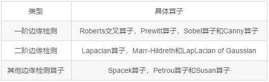
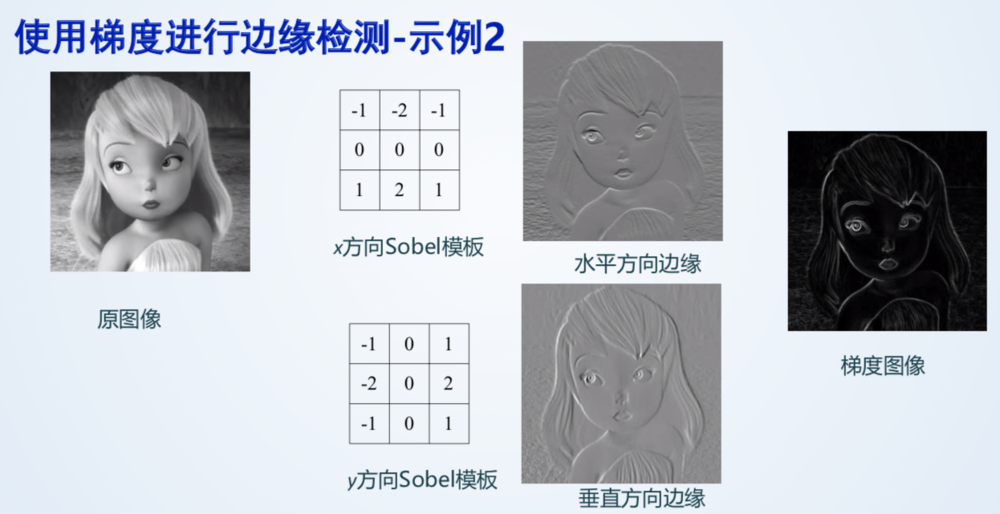
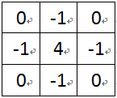
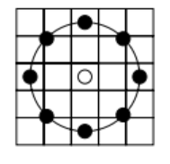
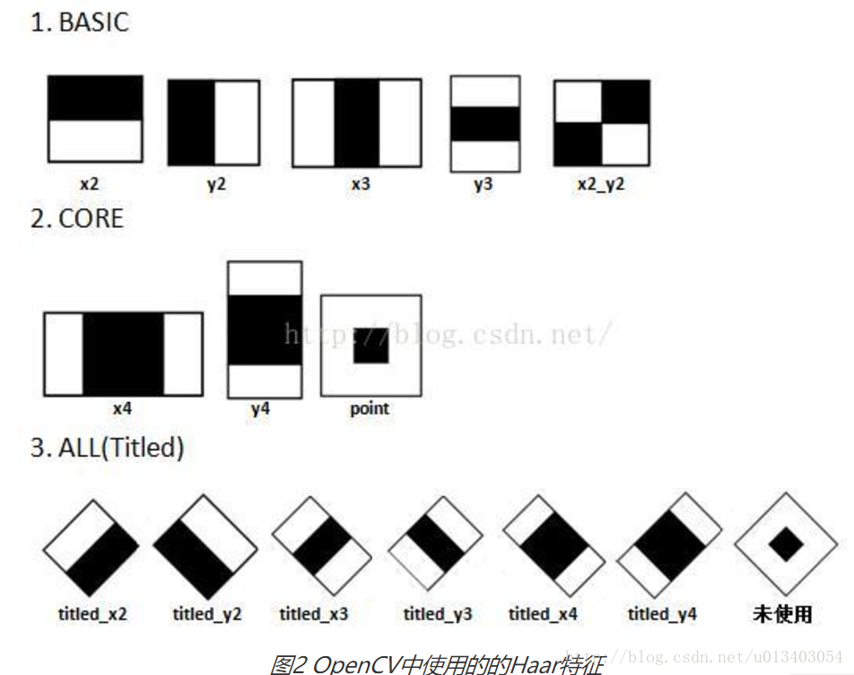
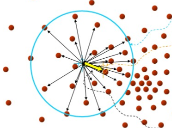
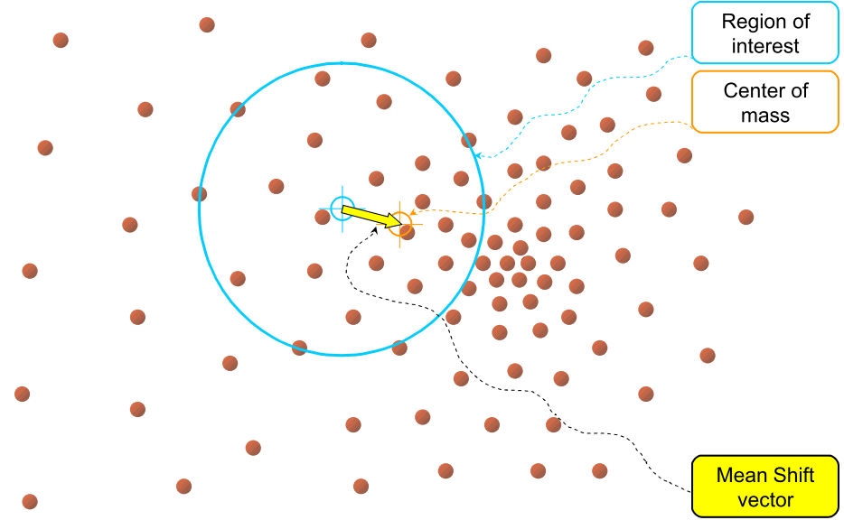

# 图像处理
[框架](https://blog.csdn.net/qq_16481211/article/details/79629794)    
[知识点](https://www.jianshu.com/p/926d6c15dbf9)   
**一.  卷积图像处理**  
1. 空间域滤波
   - 均值滤波
   - 中值滤波：取周围邻域像素中值代替原像素，去除噪声
   - 高斯滤波：根据离中心点距离，用高斯函数得到权值，确定核函数
   - 双边滤波：将一个与空间距离相关的高斯函数和一个与灰度距离相关的高斯函数相乘，灰度值越接近中心点灰度值，权重越大，可以更好保存图像边缘信息。  
（以上也称为图像平滑/模糊算法）
2. 频率域滤波（使用二维离散傅里叶变换DFT变为频域）
   - 低通滤波：去掉高频信息（理想低通，巴特沃斯低通，高斯低通）
   - 高通滤波：去掉低频信息（同上，1 - 低通滤波器）
   - 带通和带阻滤波
   - 同态滤波：消除图像上照明不均的问题，增强暗区的图像细节，同时又不损失亮区的图像细节，能够减少低频并且增加高频，从而能减少光照变化并锐化边缘细节。
3. 边缘提取   
  
   - Roberts交叉算子：2x2的模板，采用的是对角方向相邻的两个像素之差
   - Sobel算子
  
   - Canny算子，分为5个步骤：  
（1)  使用高斯滤波器，以平滑图像，滤除噪声。   
（2) 用sobel算子计算图像中每个像素点的梯度强度和方向。   
（3)  应用非极大值抑制，以消除边缘检测带来的杂散响应。   
（4)   应用双阈值检测来确定真实的和潜在的边缘，大于高阈值的为强边缘，大于低阈值但小于高阈值的为弱边缘（下一步确定是否为真实边缘）。   
（5)   通过抑制孤立的弱边缘最终完成边缘检测。
   - Laplacian算子  
    
  由水平方向二阶差分加垂直方向二阶差分得到
4. 直方图
   - 灰度直方图：将图像中的所有像素，按照灰度值的大小，统计其在某区间出现的次数。
   - 直方图均衡化：把原始图的直方图变换为均匀分布的形式，这样就增加了像素灰度值的动态范围，从而达到增强图像整体对比度的效果。
   - 直方图反向投影：计算某一特征图像的直方图模型，输出的图像与特征图像大小相同，其每一点处灰度值等于该点在直方图中对应值。然后可以使用反向投影去寻找图像中存在的该特征。  
***
**二.  形态学处理**  
 1. 膨胀：求局部最大值，将特定形状的核与图形卷积，即计算核覆盖的区域的像素点的最大值，并把这个最大值赋值给参考点（核的中心）。效果是白色区域增加。
 2. 腐蚀：求局部最小值，效果是黑色区域增加。
 3. 开运算：先腐蚀后膨胀
 4. 闭运算：先膨胀后腐蚀
 5. 形态学梯度：膨胀与腐蚀之差
 6. 顶帽：开运算与原图之差
 7. 黑帽：闭运算与原图之差
***
**三. 特征提取**  
1. **SIFT（尺度不变特征变换）**   
(1)尺度空间构建 ：对每一个尺度用不同标准差做高斯模糊(高斯金字塔)，然后每一个尺度内相邻的高斯模糊图像作差，生成高斯差分金字塔(DOG金字塔)。为保证尺度变化连续性，高斯金字塔需要多生成三幅图像，每一层第一幅图由上一层倒数第三张降采样得到  
(2)在空间邻域(3\*9-1=26个点)内检测是否为极值点  
(3)稳定关键点的精确定位：  曲线拟合寻找精确极值点；删除边缘效应  
(4)稳定关键点方向赋值：计算梯度直方图，直方图峰值代表主方向，大于80%峰值的为辅方向  
(5)关键点描述：坐标轴旋转至主方向，在周围4\*4个子区域内求八个方向区间的梯度直方图，共4\*4\*8=128维SIFT特征矢量  
(6)特征点匹配   
2. **HOG（Histogram of Oriented Gradient方向梯度直方图）**   
计算梯度图像->在每个patch内8\*8网格里计算梯度方向直方图，直方图分为9个区间->在block内(包含2\*2=4个patch)做归一化，block移动的stride=1，减小对光照敏感->所有block内的向量合并构成HOG特征向量，每个block内为4\*9=36维向量   
   - 应用：HOG + SVM行人检测
3. **LBP（Local Binary Pattern局部二值模式）**   
原始的LBP算子定义为在3∗3的窗口内，以窗口中心像素为阈值，将相邻的8个像素的灰度值与其进行比较，若周围像素值大于等于中心像素值，则该像素点的位置被标记为1，否则为0。这样，3∗3邻域内的8个点经比较可产生8位二进制数（通常转换为十进制数即LBP码，共256种），即得到该窗口中心像素点的LBP值，并用这个值来反映该区域的纹理信息。需要注意的是，LBP值是按照顺时针方向组成的二进制数。
   - 圆形化改进：黑色的采样点通过双线性插值得到像素值，再与中心点比较  

   - LBPH（LBP Histograms）:将LBP特征图像分成m个局部块，并提取每个局部块的直方图，然后将这些直方图依次连接在一起
   - 优点：一定程度消除了光照变化，具有旋转不变性，计算速度快
4. **Haar特征**  
  
 haar特征模板内有白色和黑色两种矩形，Haar特征值=白色区域内图像像素和 x 权重 - 黑色区域内图像像素和 x 权重。求像素值的和用的是积分图（类似于动态规划），即保存每个像素点到原点围成的矩形内所有像素值的和。  
   - 应用：Haar + Adaboost人脸分类
***
***
**目标跟踪**  
 1. **MeanShift**  
在d维空间中，任选一个点，然后以这个点为圆心，h为半径做一个高维球。落在这个球内的所有点和圆心都会产生一个向量，向量是以圆心为起点落在球内的点位终点。然后把这些向量都相加。  
    
然后，再以这个MeanShift 向量的终点为圆心，继续上述过程，又可以得到一个MeanShift 向量，不断地重复这样的过程，可以得到一系列连续的MeanShift 向量，这些向量首尾相连，最终可以收敛到概率密度最大得地方（一个点）。  
搜索特征采用HSV颜色空间中色调H的直方图反向投影。  
 2. **Camshift (Continuously Adaptive MeanShift) **  
以视频图像中运动物体的颜色信息作为特征，对输入图像的每一帧分别作 MeanShift 运算，并将上一帧的目标中心和搜索窗口大小(核函数带宽)作为下一帧 MeanShift 算法的中心和搜索窗口大小的初始值，如此迭代下去，就可以实现对目标的跟踪。在跟踪过程中能够依据目标的尺寸调节搜索窗口大小，对有尺寸变化的目标可准确定位。